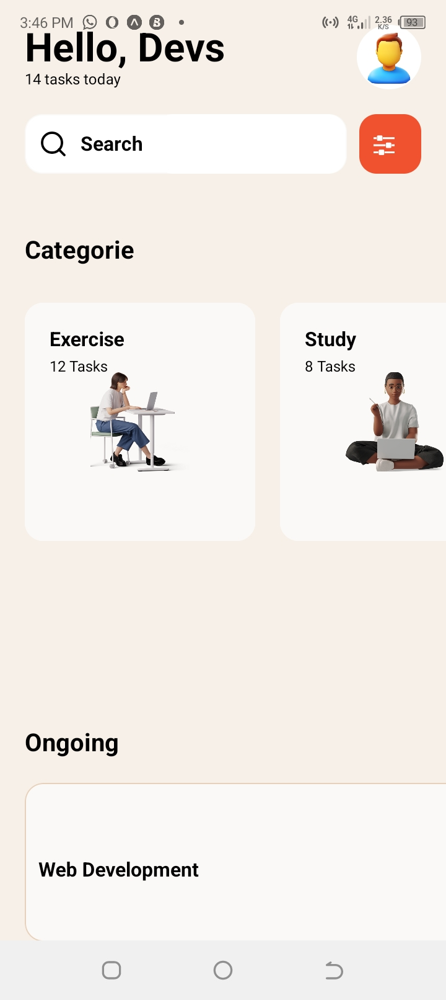

# rn-assignment3-ID-11014393

# React Native Assignment 3

## Description

This is a React Native application built using Expo. The application includes various categories and a list of ongoing tasks.

## Components

- **CategoryItem:** Displays a category with an image and name.
- **TaskItem:** Displays a single task.
- **Header:** Displays the app title and navigation options.
- **Footer:** Contains navigation links to different sections of the app.

## Screenshots

## How to Run

- Clone the repository
- Install dependencies: `npm install`
- Start the development server: `expo start`
- Scan the QR code with the Expo Go app
